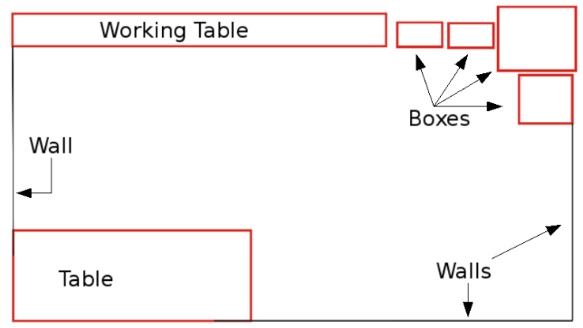

### 2.1 Wall-Following Part

### 2.1.1 Short-Term Memory Mechanisms in Neural Network Learning of Robot Navigation Tasks: A Case Study

*A. L. Freire, G. A. Barreto, M. Veloso, A. T. Varela, “Short-Term Memory Mechanisms in Neural Network Learning of Robot Navigation Tasks: A Case Study,” In: proc. 6th Latin American Robotics Symposium (LARS'2009), Valparaíso-Chile, pages 1-6*

#### I. Abstract & Introduction

This paper reports results of an investigation on **the degree of influence of short-term memory mechanisms on the performance of neural classifiers** when applied to **robot navigation tasks**.

- In particular, we deal with the well-known strategy of **navigating by “wall-following”**. 

- For this purpose, four standard neural architectures 

  - Logistic Perceptron, 
  - Multilayer Perceptron, 
  - Mixture of Experts 
  - and Elman network 

  are used to associate **different spatiotemporal sensory input patterns** with **four predetermined action categories**.

- All stages of the experiments - data acquisition, selection and training of the architectures **in a simulator** and their execution on a real mobile robot - are described. 


This paper reports the results performed with the SCI-TOS G5 mobile robot on navigation tasks. Basically, using sensor data collected after navigating in a room by following walls, four neural networks architectures are trained to take four decisions that determine its movement. 

- The data are collected by a **heuristic classifier based on IF-THEN rules**, specifically designed to guide the robot along the walls of a room. 

- Thus, the ultimate goal of the neural classifiers is to mimic the performance of the heuristic classifier as faithfully as possible. 

- The influence of short- term memory (STM) mechanisms on the performance of the classifiers are also investigated in this paper. 

The main contribution of this paper comprises :

- the empirical verification that the traditional navigation task via wall-following [1], [2], formulated as a problem of pattern recognition, is a non-linearly separable problem, 
- the verification of the hypothesis that STM mechanisms improve the performance of classifiers in the aforementioned task. 

STM is introduced in two different ways in this work: 

- for static neural networks (e.g. Logistics Perceptrons and MLP), the STM is introduced in the input units through **the time-lagged sensory observations**, (值得思考、可以改进)
- and in the case of dynamic neural networks (e.g. Elman’s network), the STM is intrinsic to the architecture itself through recurrent connections.


The obtained results suggest that 

- the wall-following task, formulated as a pattern classification problem, **is nonlinearly separable**, a result that favors the MLP network if no memory of input patters are taken into account. 
- **If short-term memory mechanisms are used, then even a linear network is able to perform the same task successfully.**


#### II. Evaluated Neural Classifiers

**Logistic Perceptron:**

The logistic perceptron (LP) is a **single-layered neural network** architecture, differing from the simple perceptron network because of the activation function, which is a **logistic sigmoid function** [3]. 

- Input patterns are represented by the vector $x(t) \in R^p$, 
- the weights vector of the i-th output neuron is denoted by $w_i(t) \in R^p$, 
- $0 <\eta < 1$ is the rate of learning 
- and $e_i(t)= d_i(t)−y_i(t)$ is the error of i-th neuron for the desired output $d_i(t)$. 
- The matrix transposition is represented by the superscript $T$, while $t$ denotes the current time step. 

The activation and output rules of the i-th neuron are given, respectively, by 
$$
u_i(t)= w^T_i(t)x(t) − θ_i(t),\\
y_i(t)= \phi(u_i(t)) = \frac{1}{1+e^{−u_i(t)}}
$$
where $θ_i(t)$ is the threshold of the i-th neuron and $\phi(u_i(t))$ is the logistic activation function.

Thus, the learning rule of the i-th neuron of the LP network is
$$
w_i(t+1) = w_i(t)+ \eta e_i(t)[y_i(t)(1 − y_i(t)] x(t)
$$
where the factor $\phi'(u_i(t))=y_i(t)(1-y_i(t))$ is the derivative of the activation function with respect to $u_i(t)$.

*Remark:*

The i-th neuron in the output layer only determined by the i-th neuron in the hidden layer. This is the biggest difference to the one layer perceptron.
$$
J=\frac{1}{2}||e(t)||^2 \\
\frac{\partial J}{\partial w_i} = \frac{\partial J}{\partial e_i}*\frac{\partial e_i}{\partial y_i} * \frac{\partial y_i}{\partial u_i} *\frac{\partial u_i}{\partial w_i}\\
= e_i(t)*(-1)(y_i(t)(1 − y_i(t)) x(t)
$$
**Multilayer Perceptron (MLP):**

In this paper we use the MLP network with only one hidden layer [3]. Both, the hidden and the output layers make use of the **logistic sigmoid function**. Thus, the output of i-th neuron $y_i(t)$, $i =1,...,c$, is given by
$$
y_i(t)= \phi [\sum_{k=1}^q m_{ik}(t) \phi (w^T_k(t)x(t) − θ_k(t)) − θ_i(t)]
$$
where 

- $x(t) ∈ R^p$ is the current input vector, 
- $w_k =[w_{k1},w_{k2},...,w_{kp},]^T$ is the weight's vector of the k-th hidden neuron, 
- $m_{ik}$ is the weight that connects the k-th hidden neuron to i-th output neuron. 
- The parameters $θ_k(t)$ and $θ_i(t)$ represent, respectively, the activation thresholds of the k-th hidden neuron and the i-th output neuron.

*Remark:*

- The weights and thresholds of the output neurons, $m_i =[m_{i0} m_{i1} ··· m_{iq}]^T$, are adjusted by the rule shown in Eq. (1). 
- Weights and thresholds of the hidden layer are  adjusted by classical backpropagation procedure of local errors’ gradients of output to the hidden layer.


**Mixture of Local Experts:**

实现代码：<https://blog.csdn.net/zc02051126/article/details/51111875>

In a sum, the objective of the Mixture of Experts (ME) approach is to **model the probability distribution of the training patterns**, {x, d} using a modular architecture with **K network experts** and a gating network [4], [5]. 

The gating network determines the output given by the K experts, according to their probabilities $g_i$, $i =1, ...,K$, subject to the following constraints:  
$$
0 ≤ g_i ≤ 1 \\
\sum_{i=1}^K g_i = 1
$$
The design of a ME architecture, whose modules consist of LP networks and a single-layered gating network with **a softmax activation function**, is summarized below. 

1. Initialization: assign small random values to the weights of the experts and gating networks: $w_i^{(m)}(n)$ and $a_i(n)$, where $i =1, 2, ...,K$ denotes the i-th module and $m =1, 2, ..., c$ denotes the m-th output neuron.

2. Adapting the Experts and the Gate: present the current input pattern $\textbf{x(t)}$ and the corresponding desired response $\textbf{d(t)}$ to the ME architecture. Then, execute the following operations:
   $$
   u_i(t)= x^T(t)a_i(t) \\
   g_i(t)= \frac{\text{exp}(u_i(t))}{\sum_{j=1}^K \text{exp}(u_j(t))} \\
   -- \\
   y^{(m)}_i (t)= x^T(t)w^{(m)}_i (t), \\
   y_i(t)=[y^{(1)}_i(t), y^{(2)}_i(t),···,y^{(c)}_i(t)]^T \\
   -- \\
   h_i(t) = \frac{g_i(t)\text{exp}(-\frac{1}{2}||d(t) - y_i(t)||^2)}{\sum_{j=1}^Kg_i(t)\text{exp}(-\frac{1}{2}||d(t) - y_i(t)||^2)}
   $$
   update:
   

$$
e^{(m)}_i(t)= d^m(t) − y^{(m)}(t)\\
δ^{(m)}_i(t)= e^(m)_i(t)(y^{(m)}_i(t)(1 − y^{(m)}_i(t)) \\
w^{(m)}_i(t+1) = w^{(m)}_i(t)+ ηh_i(t)δ^{(m)}_i(t)x(t) \\
a_i(t+1) = a_i(t)+ η[h_i(t) − g_i(t)]x(t)
$$

3. Repeat step 2 for all training patterns, i.e. t = 1, 2, ...,N.
4. Repeat steps 2 and 3 until the process converges.


**Elman Recurrent Network:** 

This dynamic neural architecture is obtained from the MLP network by **redefining the input layer of the network**, which is divided into two parts: 

- the first comprises the usual input vector x(t), 
- and the second, called units of context, is a copy of the hidden neurons’ output **at previous time t − 1**.

The weights are adjusted according to the standard backpropagation rule. 


#### III. SCITOS-G5 Mobile Robot


#### IV. Data Collection Procedure

The data collection for training the neural networks has followed the same procedure as [6] and [7]. 

```python
# the car will move along the left wall in clockwise
if leftDist > 0.9:
    if frontDist <= 0.9:
        Stop and turn to the right
    else:
        Slow down and turn to the left
else:
    if frontDist <=0.9:
        then Stop and turn to the right
    elif leftDist < 0.55:
        Slow down and turn to the right
    else:
        Move foward
        
# Disadvantages:
# 1. 仅能处理右转弯
# 2. 控制指令产生的轨迹应该是一个多边形，容易产生震荡，且走走停停，效率不高
# 3. 无法处理复杂多变的场景
```

- The navigation algorithm makes use of heuristic rules IF-THEN, acting on measures of the variables front distance and left distance, but also calculates the distances to the right and behind. 

- Each of these distances is not calculated by a single sensor, but by a number of them, that together span 60◦, **and the distance used is the smallest found by those sensors that are part of the set.** 
- These four distances are referred throughout this paper as simplified distances. 

This information is collected as the SCITOS G5 navigate through the room, during four rounds. The arrangement of objects located in the test room can be seen in Figure 2 and the trajectory executed by the robot is shown in Figure 3.

The data collection was performed at a rate of **9 samples per second** and generated a database with **5456 examples**. These data are used to train the neural classifiers presented earlier in order to evaluate which one **“mimics” the Algorithm IV.1** better.




#### V. Experiments and Results

**Static Classification: (without the use of STM mechanisms)** 

The first experiments are performed without the use of STM mechanisms, so that the task of navigation can be formulated as a static classification problem. 

- In this case, the **LP network** consists of a single layer with c = 4 output neurons, each one representing a different action (class): 

  - move forward (Class 1), 
  - slight right-turn (class 2), 
  - sharp right-turn (class 3) 
  - and slight left-turn (class 4).

  The LP network is trained for 200 epochs, the learning rate is set to η =0.02. 

- The **ME architecture** is a network formed by a LP gating network of four neurons, K = 4 LP experts, each expert with four output neurons. The training of the ME architecture is carried out for 35 epochs with the learning rate set to η =0.02. 

- For the **MLP network**, preliminary tests were made with different numbers of hidden neurons to find out the minimum value that enables a suitable class separation. It was found that q = 6 is that minimum value. The output layer consists of c = 4 neurons with logistics activation function. The MLP is trained for 500 epochs with a learning rate set to η =0.05. 

**Notation:**

- LP (I, O) - logistic perceptron network with I inputs and O output neurons; 
- ME (I, K, O) - mixture of experts network, in which K is the number of experts; 
- MLP (I, q, O) - multilayer perceptron network with q hidden neurons; 
- and Elman(I+q, q, O) - Elman network with I+q inputs and q hidden neurons. 

**Results:**

For the static classification task, we used only **2 input units**, corresponding to the simplified distance ahead and to the left of the robot SCITOS-G5. The offline training/testing results are shown in Tables I and II. 


- In the experiment with the network LP(2,4) without STM, the trajectory performed by the robot is shown in Figure 4. 
  - One can observe that there was no collision, but the robot was not able to execute the left-turn. 
  - A reduced discrimination ability was expected because of the low number of samples correctly classified in the corresponding confusion matrix (Table II). 


- With the architecture ME(2,4,4) without STM, the robot was able to almost complete a round in the room before colliding (Figure 5). 

  - The robot was repositioned from the local it collided, but when it was supposed to turn left, he turned right and remained in that movement. Analyzing the actions stored in the database, we noted that the robot used, mostly, the action slight right-turn and, in a very few attempts, a sharp right-turn. 

  

- The **MLP network achieved the best performance**, as shown in Figure 6. Its recognition rates are shown in Table II.

  

**Spatiotemporal Classification:** 

Additional experiments are conducted to evaluate 

- (1) if the use of STM improves the performance of the classifiers that performed poorly in the previous experiments, 
- and (2) if the use of STM allows a reduction in the number of hidden neurons in the MLP architecture, thus reducing its computational cost. 

The first network to be tested is the LP architecture, 

- which is fed not only with the current simplified distances, measured by the ultrasound sensors, **but also by their recent past values.** 
- Except for the change in the dimensionality of the input vector, the training parameters remain the same as the experiments conducted without STM. 
- ***The LP network was tested with 1, 2, 3, 5, 9, 34 and 49 past samples (observations) of the simplified distances. Only the results with 9 past samples of these distances are presented in this paper, since it was the best configuration found.*** Thus, the input vector is composed by the current values and the past nine values of each of the two simplified distances, resulting in an input vector with **20 components**. 

Analyzing the results shown in Figure 7 and Tables III and IV, 


*Results:*

- we find a clear improvement in the performance of the LP network with the inclusion of STM mechanisms. 

  

- For the ME architecture, the use of time-lagged observations did not improved the performance of the robot navigation at all and hence the results are not shown in this paper. 

- An alternative STM mechanism can be implemented through recorrent connections [8]. To determine whether this type of STM improves the performance of multilayered neural architectures, the Elman network was evaluated in the robot navigation task. As input, the Elman network uses only the current readings of ultrasound sensors together with q context units. The training parameters are the same the MLP network used for the static classification task, except the rate of learning (η =0.05). After several tests varying the number of hidden neurons, it was found that the minimum value for the robot to successfully perform the required task is q = 4, 2 less neurons than the MLP network used in static classification problem. 

  - **It is important to emphasize that the network MLP(2,6,4) was already able to solve the task without STM; however, the inclusion of STM through recurrent loops as in Elman network, allowed the optimal classifier to have less hidden neurons.**

    

**Decision Surfaces:** 

A method to evaluate the performances of the classifiers in the navigation task of interest is through **visualization of the decision regions** implemented by each one. 

- In Figures 9(a) and 9(b) one can note that the inclusion of STM allowed a better separation of classes by the classifiers, in the case of LP network. Each point in figures corresponds to a pair of measurements of simplified distances in a given moment of time along the trajectory executed by the robot. The colors help differentiating the sensory readings belonging to each of the four classes defined for the navigation task (class 1 - red; class 2 - green; class 3 - blue; class 4 - yellow). 
- In short, we find an improvement in the distinction of four classes by LP network with STM if we compare with LP without STM. 
- **The MLP and Elman’s networks, which achieved the best performances in the navigation task**, produced similar decision surfaces (Figures 9(c) and 9(d)), although the Elman network achieved its result with two neurons less in the hidden layer.


#### V. Conclusion

This study compared the performance of four neural classifiers used as controllers in the wall-following navigation task in a real mobile robot. 

- For this, the navigation task is formulated as a pattern recognition problem, in which the patterns are the sensor readings and classes are actions to be taken by the robot. 
- We evaluated the logistic perceptron network, the mixture of experts architecture (with experts trained with logistic perceptron networks), the multilayer perceptron network and the Elman recurrent network. 
- In general, the MLP network achieved the best performance among the four classifiers evaluated. 
- The experiments showed that an apparently simple navigation task is indeed a complex decision-making task. The use of short-term memory mechanisms by the logistic perceptron classifier allowed it to successfully accomplish a nonlinear separable classification task. The use of short- term memory also allows, via recurrent loops, a multilayered neural architecture to reduce the number of hidden neurons, without compromising the discriminative ability of the classifier. 

In future works, we aim at investigating the performance of SVM classifiers on the wall-following navigation task as well as evaluating other types of short-term memory mechanisms, such as the one implemented by the Echo- state network recurrent architecture [6].


### 2.1.2 Real-time navigational control of mobile robots using an artificial neural network

*D. R. Parhi, M. K. Singh, "Real-time navigational control of mobile robots using an artificial neural network", Proceedings of the Institution of Mechanical Engineers Part C: Journal of Mechanical Engineering Science, vol. 223, pp. 1713-1725, 2009.*


#### I. Introduction 

One of the most important issues in the design and development of an intelligent mobile system is the navigation problem. This consists of the ability of a mobile robot to plan and execute collision- free motions within its environment. However, this environment may be imprecise, vast, dynamical, and either partially structured or non-structured. Robots must be able to understand the structure of this environment [1–5].

To reach their targets without colliding, robots must be endowed with perception, data processing, recognition, learning, reasoning, interpreting, and decision-making and action capacities.

Service robotics today require synthesizing robust automatic systems able to cope with a **complex and dynamic environment** [6]. 

- To demonstrate this kind of autonomy Muñiz et al.[7] introduced a neural controller for a mobile robot that learns both forward and inverse odometry of a differential drive robot through unsupervised learning. They introduced an obstacle-avoidance module that is integrated into a neural controller. However, generally, the evolved neural controllers could be fragile in inexperienced environments, especially in real worlds, because the evolutionary optimization processes are executed in idealized simulators. **This is known as the gap problem between simulated and real worlds.** 

- To overcome this, Kondo [8] focused on an evolving on-line learning ability instead of weight parameters in a simulated environment. Based on this, a neuromodulatory neural network model was proposed by them and is utilized as a mobile robot controller. 

- Corradini etal.[9] used a neural network approach for the solution of the tracking problem of mobile robots. 

- Racz and Dubrawski [10] presented a neural network-based approach for mobile robot localization in front of a certain local object. 

- Yang and Meng [11] proposed a biologically inspired neural network approach for real-time collision-free motion planning of mobile robots or robot manipulators in a non-stationary environment. 

- Braganza et al.[12] described a controller for continuum robots, which utilizes a neural network feed-forward component to compensate the dynamic uncertainties. 

This article has proposed a neural network-based approach for the solution of the path and time optimization problem of mobile robots. A biologically inspired neural network has been used for real-time collision-free motion planning of mobile robots in an unknown environment. 

- A four-layer perceptron neural network has been used to design the controller. The first layer is used as an input layer, which directly reads from the arrays of sensors of the robot. The neural network consists of two hidden layers, which adjust the weight of the neuron, and an output layer, which provides the heading angle of the robot. 

- The back- propagation method has been used to minimize the error and optimize the path and time of the mobile robot to reach the target. 


#### II. Kinematics Analysis of the Mobile Robot

The kinematics analysis of the Khepra-III mobile robot has been worked out in this section. The kinematics model of the Khepra-III mobile robot is shown in Fig. 1. 


It consists of a vehicle chassis with two driving wheels mounted on the same axis and a front point sliding support. The two driving wheels are independently driven by two actuators to achieve the motion and orientation. 


Both wheels have the same diameter denoted by 2r (Fig. 2). The two driving wheels are separated by distance W. The center of gravity (COG) of the mobile robot is located at point ‘C’. Point ‘P’ is located at the intersection of a straight line passing through the middle of the vehicle and a line passing through the axis of the two wheels. The distance between points P and C is d. 

A motion controller based on a neural network technique has been proposed for navigation of the mobile robot. The main component in the motion controller is the **low-level inverse neural controller**, which controls the dynamics of the mobile robot. The kinematics of the differential drive mobile robot is based on the assumption of pure rolling and there is no slip between the wheel and surface.
$$
v_t = \frac{1}{2}(v_r + v_l) \\
w_t = \frac{v_r − v_l}{W} \\
v_r = rw_r \\
v_l = rw_l
$$


where v is the linear velocity and ω is the angular velocity of the vehicle. Superscript r, l, and t stand for right wheel, left wheel, and tangential (with respect to its COG point ‘C’ measured in a right wheel), respectively.

The position of the robot in the global coordinate frame $[O X Y]$ is represented by the vector notation as
$$
q =[X_c Y_p θ]^T 
$$
where $X_c$ and $Y_p$ are the coordinates of point P in the global coordinate frame (Fig. 2). The variable θ is the orientation of the local coordination of the local coordinate frame $ [P X_c Y_p]$ attached on the robot platform measured from the horizontal axis. Three generalized coordinates can describe the configuration of the robot as equation (4). 

The mobile robot system considered here is a rigid body and the wheels are pure rolling and no slippage. This states that the robot can only move in the direction normal to the axis of the driving wheels.Therefore, the component of the velocity of the contact point with the ground, orthogonal to the plane of the wheel, is zero [15, 16], i.e.
$$
[\dot{y}_p \cos \theta − \dot{x}_c \sin \theta − d\dot{\theta} ]= 0
$$
 *Remark: the slide moving velocity of the car can be described by $d \dot{\theta}$*

All kinematics constraints are independent of time, and can be expressed as
$$
A^T(q) \dot{q} = 0
$$
where A(q) is the input transformation matrix associated with the constraints
$$
C^TA(q) = 0
$$
where C(q) is the full rank matrix formed by a set of smooth and linearly independent vector fields spanning the null space of AT(q). From equations (6) and (7) it is possible to find an auxiliary vector time function V(t) for all time t
$$
\dot{q} = C(q)V(t)
$$
The constraint matrix in equation (6) for a mobile robot is given by
$$
A^T(q) =[−\sinθ \quad \cosθ \quad −d]
$$
The C(q) matrix is given by
$$
\begin{bmatrix}
   \cos\theta & -d\sin\theta\\
   \sin\theta & d\cos\theta \\
   0          & 1
  \end{bmatrix}
$$
and
$$
V(t) = [v \quad w]^T
$$
where v is the linear velocity of the point 'p' along the robot axis and w is the angular velocity.

Therefore, the kinematics equation in (8) can be described as 
$$
\dot{q} =  
\begin{bmatrix}
   \cos\theta & -d\sin\theta\\
   \sin\theta & d\cos\theta \\
   0          & 1
  \end{bmatrix}
 \begin{bmatrix}
   v \\
   w
 \end{bmatrix} \tag{12}
$$
Equation (12) is called the steering system of the vehicle. The control problem is to find a suitable control law so that the system can track desired reference trajectories. The control laws are designed to produce suitable left and right wheel velocities for driving the mobile robot to follow required path trajectories.


#### III. Analysis of a Neural Network for Navigation

Artificial neural networks consist of a set of simple, densely interconnected processing units. These units transform signals in a non-linear way. Neural networks are non-parametric estimators that can fit smooth functions based on input–output examples [17]. 

- The neural network designed in this article is a four-layer perceptron. The number of layers is set empirically to facilitate the training. 
- The input layer has four neurons, three for receiving the values of the distances from obstacles (i.e. in front and to the left and right of the robot) and one for the target bearing. **If no target is detected, the input to the fourth neuron is set to ‘zero’.** 
- The output layer has a single neuron, which produces the steering angle to control the direction of movement of the robot. 
- The first hidden layer has ten neurons and the second hidden layer has three neurons. These numbers of hidden neurons were also found empirically. 


The neural network is trained to navigate by presenting it with 200 patterns representing typical scenarios, some of which are depicted in Fig. 4. 


### 2.1.3 A Robust Wall-Following Robot That Learns by Example

 C. D. Hassall, R. Bhargava, T. Trappenberg, O. E. Krigolson, "A robust wall-following robot that learns by example", *Dalhousie Computer Science In-House Conference (DCSI)*, 2012.


#### I. Introduction

We are interested in finding an effective strategy for a robot to recover after its physical configuration has been changed. 

Freire et al. (2009) tested different neural network classifiers to predict the best actions for this task based on current sensor data. They found that even this seemingly simple navigation task required complex decision-making. 

In our study we wanted to compare the effectiveness of different strategies in solving the **adaptive wall-following task** with a small number of very noisy training data. 

- We were specifically interested in comparing nearest-neighbour classification (Schulz et al., 2009) with regression methods able to predict a continuum of possible actions. We therefore evaluated how the number of classes influenced performance, and tested simple linear regression and the more sophisticated SVR. 
- The robot was built from standard Lego Mindstorms NXT components and only the very inaccurate ultrasonic sensor was used to sense the environment. 
- Our aim was to compare simple supervised learning strategies where the robot was shown examples of appropriate behavior from which it had to generalize. 
- To make sure that this learning could accommodate different plants, we tested several alterations of the robot, including changing one wheel to a different size, and interchanging the wheel motor control cables.


#### II. Design

**Hardware:**
The robot used in this study was a standard NXT tribot, along with a top-mounted ultrasonic sensor on a motor that provided 360 degrees of rotation (Figure 1). A front-mounted active light sensor was available, but unused in our design. All three motors included an internal rotational sensor.


**Software:**
Data analysis and visualization were also done in MATLAB. SVR was done using LIBSVM, a MATLAB library for support vector machines (Chang and Lin, 2011).

**Design Strategy:**
The use of negative feedback is a common control strat- egy (van Turennout, Honderd, and van Schelven, 1992). We tested a manually- tuned proportional controller (P controller). We found this strategy to be unstable and not robust to modification. We observed that following many modifications, the feedback controller could not be properly tuned to compensate.

During the wall-following task, new ultrasonic data were recorded and compared to the training data. The new data were then classified using the k-nearest neighbour (k-NN) algorithm (Russell and Norvig, 2003).


### 2.1.4 Associative Model for Solving the Wall-Following Problem

*Navarro, Rodolfo; Acevedo, Elena; Acevedo, Antonio; Martinez, Fabiola, "Associative*
*model for solving the wall-following problem," in Pattern Recognition, J. C. e. al.,*
*Ed., Berlin, Springer, 2012, pp. 176-186.*

#### I. Introduction

This navigation system is called Wall-Following which has become a classic problem of
the Robotics. Some researchers have proposed solutions using diverse computational tools for improving the performance, these tools are: Genetic programming [6], Fuzzy logic [7],
Computer vision [8], Vector Field Histogram [9], a system based on sonar and odometric sensorial information [10], Chaos theory [11][12], Hopfield neural network, [13], Topological mapping [14], systems implemented in hardware together with Lyapunov functions [15], Proportional Derivative (PD) controllers [16], IR Sensors [17][18] and Distance sensors [19].

***Remark:*** 针对室内导航，Wall-following 是一个比较老/经典的解决方案，但大家的研究只关注角速度，我们考虑角速度与速度，使整个系统更加实用。

In this work, we applied the associative approach to solve the Wall-Following problem. We used the **morphological-based associative memory as classifier** and the data was obtained from the UC Irvine Machine Learning Repository [20]. In [21] other results are reported from works which used the same data. 


### 2.1.5 Classification-based learning by particle swarm optimization for wall-following robot navigation

#### I. Abstract & Introduction

In this paper, we study the parameter setting for a set of intelligent multi-category classifiers in wall-following robot navigation. 

- Based on the swarm optimization theory, a particle selecting approach is proposed to search for the optimal parameters, a key property of this set of multi-category classifiers. 

- By utilizing the particle swarm search, it is able to obtain higher classification accuracy with significant savings on the training time compared to the conventional grid search. 

- For wall-following robot navigation, the best accuracy (98.8%) is achieved by the particle swarm search with only 1/4 of the training time by the grid search. 

- Through communicating the social information available in particle swarms in the training process, classification-based learning can achieve higher classification accuracy without prematurity. 

- One of such learning classifiers has been implemented in SIAT mobile robot. Experimental results validate the proposed search scheme for optimal parameter settings.


In mapless navigation, the system uses no explicit representation about the space in which navigation is to take place [8], where the robot motions are determined by observing and extracting relevant information about the elements (such as walls, desks or doorways) in the environment, and navigation is carried out with respect to these elements. To navigate, the robot uses sensors to calculate the distance of the objects. Many sensors have been used to find the objects, including infrared sensor, laser range finder, visible-light camera, and ultrasonic sensors [9]. For example, SIAT mobile robot uses ultrasonic sensors to avoid collision as shown in Fig. 1. 

Wall-following navigation is a kind of motion that the robot moves along the wall in a certain direction, or more generally, moves along the exterior of objects while keeping a safe distance away from objects [10]. When it is combined with other high-level intelligent behavior, the robot can accomplish complex tasks [11]. 

Recently, intelligent controllers developed using artificial neural network, fuzzy logic, genetic algorithms, or a combination thereof are appealing to deal with such complicated systems.

- Modeling a human expert control strategy (HCS) [12] with learning-based algorithms is a fine solution for the control of dynamic systems with unstructured uncertainties and fast-changing un-modeled dynamics. However, it is difficult to model the human expert control strategy. In such a case, collecting the needed training data to build a sufficiently accurate learning model for an intelligent classifier is one of the promising solutions. 
- For the wall-following robot navigation, empirical evaluation of this task is a problem of pattern recognition and could be modeled as multi-category classifications. Extending a classifier from binary to multiple categories is still an ongoing research topic [13,14]. 

Generally, a single multi-class problem is considered as a collection of multiple binary problems. The problem is interpreted as a cascade of hierarchical binary-tree classifiers. Therefore, multi-category classification is considered in the framework of hierarchical-cascaded trees, for parallel and easy implementation with hardware circuits to satisfy the real-time requirement. 

When training the classifiers for high accuracy, it is essential to select the parameter of each binary classifier at each node in the hierarchy. 

- Conventionally, grid search is the approach taken. Between the minimum and maximum values of each parameter the method divides the range into several grid-like corresponding dots to select the optimal point. However, doing a complete grid- search may be time-consuming, especially for a large amount of parameters. In training classifiers with low computational complexity, a simple grid-search method can meet the needs for practical applications; 
- however, in training classifiers with high computational complexity, instead of performing exhaustive search for the best parameters, sample-based optimizations such as particle swarm methods [15,16] are proposed to efficiently select the parameters. 

Particle swarm optimization (PSO) is a parallel algorithm originally developed by Kennedy and Eberhart based on a metaphor of social interaction [17,18]. It is a powerful and easily implemented algorithm to solve optimization problems, especially in a multidimensional vector space. 

- The PSO algorithm is initialed with a population of random candidate solutions, each of which is called a ‘‘particle’’, with a randomly assigned velocity and position. 
- Then, each particle is attracted stochastically towards the location of its own previous best fitness and the best fitness of its neighbors. 
- When particles are unable to escape from a local optimum after hundreds or thousands of iterations, there exist invalid iterations in PSO [19,20] during the optimization of various continuous functions. 

The problem is mainly because that the algorithm lacks an effective scheme to escape from the local optimum. To overcome the premature property of PSO, a hybrid PSO (HPSO) algorithm is proposed by integrating the basic PSO with local optimization of pattern search. In each iteration, particles are selected with a probability, where pattern search is performed and the original particles are replaced to improve the precision of convergence if the new fitness value is better. HPSO enables the parameter optimization to possess parameter-fitness capability both globally and locally such that it can be more effective than the basic PSO to achieve an optimal performance. Using the HPSO algorithm, optimal parameters can be efficiently selected via reducing the complexity iteratively and avoiding irrelevant calculations.


### 2.1.6 Learning of Robot Navigation Tasks by Probabilistic Nerural Network

This paper reports results of artificial neural network for robot navigation tasks. Machine learning methods have proven usability in many complex problems concerning mobile robots control. **In particular we deal with the well-known strategy of navigating by “wall-following”.** In this study, probabilistic neural network (PNN) structure was used for robot navigation tasks. The PNN result was compared with the results of the Logistic Perceptron, Multilayer Perceptron, Mixture of Experts and Elman neural networks and the results of the previous studies reported focusing on robot navigation tasks and using same dataset. It was observed the PNN is the best classification accuracy with 99,635% accuracy using same dataset.


### 2.1.7 Linguistic Decision Making for Robot Route Learning

H. He, T. McGinnity, S. Coleman, B. Gardiner, "Linguistic Decision Making for Robot Route Planning", *IEEE Transactions on Neural Networks and Learning Systems*, vol. 25, no. 1, pp. 203-215, 2013.


#### Abstract

Machine learning enables the creation of a nonlinear mapping that describes robot-environment interaction, whereas computing linguistics make the interaction transparent. 

- In this paper, we develop a novel application of a linguistic decision tree for a robot route learning problem by dynamically deciding the robot’s behavior, which is decomposed into atomic actions in the context of a specified task. 

- We examine the real-time performance of training and control of a linguistic decision tree, and explore the possibility of training a machine learning model in an adaptive system without dual CPUs for parallelization of training and control. 

- A quantified evaluation approach is proposed, and a score is defined for the evaluation of a model’s robustness regarding the quality of training data. 

Compared with the nonlinear system identification nonlinear auto-regressive moving average with exogenous inputs model structure with offline parameter estimation, the linguistic decision tree model with online linguistic ID3 learning achieves much better performance, robustness, and reliability.


#### I. Introduction

The ability to learn automatically is a major step forward in robotics, enabling a more widespread adoption of robots in a range of applications. Machine learning technologies enable us to train a model with a set of training samples, and thus to obtain approximately accurate model parameters. Hence, they offer a good approach to robot learning. Machine learning enables the creation of a nonlinear mapping that describes robot-environment interaction, and the trained models are validated by comparing the behavior of the robot with that represented by the training data. 

There is some related work in the literature. 

- For example, in the earlier literature, Krishna and Kalra [11], [12] proposed a real-time collision avoidance algorithm by classifying the environment based on the **spatio-temporal sensory sequences**. They used a double layered classification scheme, in which, a fuzzy rule base is used for the spatial classification at the first level and at the second level Kohonen’s self-organizing map and a fuzzy ART network is used for temporal classification. 

- Recently, Freire et al. [3] investigated four structures of neural network (NN) classifiers for the wall-following navigation task with a real mobile robot, and examined the influence of short-term memory mechanisms on the performance of neural classifiers. 
- Kostavelis et al. [10] used a support vector machine (SVM) classifier to detect nontraversable scenes using solely stereo vision input. 
- Mulero–Martinez [17] developed a GRBF static NN controller supervised by a switch logic, allowing arbitration between a NN and a robust proportional-derivative controller, for stable adaptive tracking of a robot manipulator. 

The approaches mentioned above are essentially classification-based approaches. An alternative methodology is that based on nonlinear auto-regressive moving average with eXogeneous inputs (NARMAX) or equivalent techniques. A NARMAX model [2] is a general and natural representation of nonlinear systems. When a nonlinear system is represented with a polynomial, the problem of parameter estimation becomes a linear regression problem, which can be solved with the least squares algorithms. Hence, a NARMAX model polynomial can be used to directly produce the mapping between control code (the velocity of a robot in the implementation) and environment perceptions, and it is applied to simulate a robot’s behavior for the robot’s route learning problem [9], [13], [19]. 

Generally, the ability of a robot simulator to predict accurately depends on three models: 1) the robot model; 2) the task model; and 3) the environment model [13]. 

- The environment model provides the robot’s sensory perception, based on the robot’s position and orientation. For the approaches above, the environment model is of the most interest. However, it requires robots to randomly learn the whole environment. As in [9], the sensory perception of a robot is calculated by the environment model, and the estimated sensory perception is as the input of a control model. There exists accumulated errors. If the training data does not represent the environment sufficiently accurately, then the inaccurate environment model can lead to inaccurate robot behavior. 
  - A human driving a robot to learn a route can be analogous to an adult leading a child to walk through a path. Thus fast learning only requires obtaining the perception of a robot relative to the environment in a specified route, instead of the whole environment. 
- To improve the accuracy of a robot’s behavior for a specified task, a reasonable approach is to decompose the behavior of the robot in the task to atomic actions. The key requirement is then to decide the critical points where the robot switches its action from one atomic action to another. Because of the uncertainty inherent in environmental conditions, and given that the perception of the robot’s current position in the environment is a consequence of the last behavior of the robot in the environment, including any errors, dynamic decision making based on the perception is necessary. 

Decision trees are popularized by Quinlan [23] with the ID3 induction algorithm. Decision tree techniques are already shown to be interpretable, efficient, problem independent and able to treat large scale applications [21]. A linguistic decision tree (LDT) [15], [22] is a type of probabilistic tree that combines a decision tree with label semantics [14]. Machine Learning is concerned equally with classification and regression problems, and considerable research on classification and regression is based on static databases [5], [6], although there is some research on machine learning for real-time control. The introduction of LDT is also based on static databases [15], [22]. Lan and Liu [24] investigated a neurophysiological decision-making mechanism for robot behavior coordination demonstrated by the pushing stick task. However, such decision making misses linguistic interpretation. A linguistic decision tree can improve the transparency of the interaction between the robot and environment. 

In this paper, we develop a LDT to dynamically control a robot’s behavior by using the robot’s sensory perception in the specified environment as the input attributes of the LDT for the robot route learning problem. Alippi et al. [1] proposed an effective just-in-time adaptive classifier. However, as the computing complexity of training a machine learning model poses a big challenge when applying it to real-time control, we examine the real-time performance of training, and explore the possibility of dynamic training through experimentation without updating the training data in each run. We also compare the offline and online performance. In addition, we propose a quantified approach to evaluating the performance of the robot’s learning. 

Unlike the simultaneous localization and mapping (SLAM) method for mobile robot navigation, in which a map of the environments is necessary, the LDT approach does not need any map, but the perception of environments. In addition, SLAM has two main problems. The first problem is the computational complexity due to the growing state vector with each added landmark in the environment. The second problem is the data association that matches the observations and landmarks in the state vector [25]. However, once the LDT model is learned, the complexity of the LDT model is almost fixed, as the number of input attributes in the trained LDT and the number of labels for each attribute are fixed. Mucientes et al. [16] used a genetic algorithm to produce weighted linguistic rules to control an autonomous robot. However the genetic search is clearly an offline process. 

Nguyen–Tuong and Peters [18] employed a local kernel-based learning for the online approximation of a multivalued mapping, and they argued that learning models for task-space tracking control from sampled data is an ill-posed problem, as the same input data point can yield many different output values. We will show that the proposed LDT model for robot’s route learning is robust, whereas in an NARMAX model with offline learning, the ill-posed problem remains. 


### 2.1.8 Neural Network Approach to Control Wall-Following Robot Navigation

Abstract—In any robotics application, the deployed robot has to navigate from source to a destination for performing task(s). Efficient control of this navigation is a major research challenge in the field. 

In this paper, an attempt has been made to develop a neural network (NN) based controller for navigation of wall following robot. 

- The primary focus is to control the robot to take decision of changing direction based on a set of sensor readings, where the sensors are fit around of the waist of the robot (SCITOS G5 robot in this work). 
- The NN is trained by these sensor readings dataset (a collection of multiple such instances) and predicts the future control strategy. 
- The NN is trained with gradient descent algorithm. 
- An extensive parametric study has been conducted to set the optimal number of nodes in the hidden layer and the learning rate. 
- The experimental result shows that the proposed algorithm can control the robot with 92.67% accuracy and can take decision within 1 second.

#### I. Introduction

And autonomous path navigation plays a vital role in solving these problems. Autonomous robots are basically designed to deal with the real time environment, which is complex and nonlinear in nature. In addition to that the robot can only observe the environment partially which makes the problem more critical. So, the task of establishing a successful path navigation policy becomes pretty challenging one [4]. (环境也很难去建模)

With traditional techniques it would have been difficult to address this type of problems as it would be very difficult to deal with the nonlinear and dynamic nature of the problem. However, with the evolution of artificial intelligent techniques such as Artificial Neural Networks (ANN), it seems not much of a challenge. The learning ability of ANNs from their past experience makes them capable enough to find out the solution through non-linear environment. And hence, ANN has been successfully applied to solve benchmark problems [5] and real world control problems [6,7].


#### II. Literature Review 

- Knudson and Tumer in [4] have developed the policy search based navigation. The search through population policies allows for the discovery of new and robust control strategies [5,6,7]. They have evaluated reactive and learning navigation algorithms for exploration robots that must avoid obstacles and reach specific destinations in limited time and with limited observations. 
  - Their result showed that neuro-evolutionary algorithms with well-designed evaluation functions give up to 50% better performance than the existing algorithms like the reactive algorithms in complex domains.
- Chen et al. proposed particle selecting approach to search for optimal parameters. They have implemented parameter optimizations of intelligent classifiers for wall-following robot navigation. As compared to conventional grid search, the particle swarm search is able to get higher classification accuracy of more than 90% [10].
- Mucientes et al. described the automated design of a fuzzy controller using genetic algorithms for the implementation of the wall-following behavior in a mobile robot [11]. The algorithm was based on the iterative rule learning approach. Here, the designer has to define the universe of discourse and the precision of each variable, and also the scoring function. However, no restrictions were placed neither in the number of linguistic labels nor in the values that define the membership functions. Works in [12,13] focused on tuning the set of fuzzy controller parameters such as membership functions, scaling factors and control role configuration for robot navigation problems.
- He et al. proposed a multi-instance multi-label learning Gaussian process (MIMLGP) algorithm for solving the multiple labels problems in visual mobile robot navigation. They compared the proposed MIMLGP algorithm with the existing multi-label (ML) algorithms [14]. Katsev et al. analyzed a simple robot with local sensors that moved in an unknown polygonal environment. The robot could traverse the interior of the environment only when following parallel to an edge. The robot had no global sensors that would allow precise mapping or localization [15]. A complete survey report on robot navigation has been given by Kruse et al. [16]. 

#### III. Materials and Method

This section describes the proposed robot navigation controller mechanism using neural network. In this work, following steps are followed. 

**A. Collection of sensor readings of SCITOS G5 robot** 

In this research, the datasets are the collection of sensor readings when the robot navigates through the room following the wall in a clockwise direction, for 4 rounds [17]. The robot uses 24 ultrasound sensors arranged circularly around its ‘waist’. The numbering of the ultrasound sensors starts at the front of the robot and increases in clockwise direction. The dataset was collected from UCI machine learning repository [18]. For efficient testing of the proposed method, three data files are used. The first one contains the raw values of the measurements of all 24 ultrasound sensors and the corresponding class label. The second file contains four simplified distances such as front, left, right and back along with the corresponding class level. The third file contains only the front and back simplified distance and the class level. It should be noted that the 24 ultrasound sensor readings and the simplified distances were collected at the same time step, so each file has the same number of instances (one for each sampling time step). There are four class levels in all the files; (i) move-forward, (ii) slight-right-turn, (iii) sharp-right-turn and (iv) slight-left-turn. 


**B. Normalization of dataset** 

As the dataset files contain the raw data, the data are normalized using min-max procedure. The formula for the same has been given in Eq. (1) below; where $y_i$ is the normalized value of the i-th data element.
$$
y_i = \frac{x_i-min(x)}{max(x)-min(x)}
$$
**C. NN architecture** 

The proposed NN architecture has three layers (i) Input layer (IL), (ii) hidden layer (HL) (iii) output layer (OL) which is show in Fig. 1. 


There is a single neuron in the OL which takes decision of the robots next move (direction). Let $V$ denotes the weight vector from IL to HL and W denotes the weight vector from HL to OL. Biases in HL and OL are $b_1$ and $b_2$ respectively. Learning rate and momentum factor are denoted as α and µ respectively. Activation function used in HL and OL is sigmoid and is denoted as $f$; where $f(x) = 1/(1+exp(-x))$. 
$$
Z_{in} = b_1 + \sum_{i=1}^n X_i Vin_{i} \\
y_{in} = b_2 + \sum_{i=1}^m Z_i W_i \\
\Delta W = (\alpha * E * f'(y_{in})*Z_i) + \mu*\Delta W_{old} \\
\Delta b2 = \alpha * E * f'(y_{in}) \\
\Delta W = (\alpha * E * f'(y_{in})*W*f'(Z_i)*X) + \mu*\Delta v_{old} \\
\Delta W = \alpha * E * f'(y_{in})*W*f'(Z_i) \\
$$
Equations 2–7 are used during the processing by the neural network. Where, Vini represents the incoming input-hidden layer weight to the considered node for which net input Zin is being calculated. It should be noted that all the input, processing and output are carried out with decimal values only.

**D. Pseudo-code oftraining algorithm**

```python
Initialize W, V, b1, b2, α, µ, MSE = 0; 
while (termination criteria is not satisfied) do:
    for each sensor readings instance:
        for each hidden neuron:
            Compute Zin using Equation-2 
            Compute Z = f(Zin)
        Compute yin using Equation-3 
        Compute Y Calculate error, E = T–Y; where T is the target 
        ## Back propagate the error to update weights 
        Calculate ∆W using Equation-4 
        Update W(new)=W(old)+∆W 
        Calculate ∆b2 using Equation-5 
        Update b2(new)=b2(old)+ ∆b2 
        for each hidden neuron: 
            Calculate ∆V using Equation-6 
            Update V(new)=V(old)+∆V 
            Calculate ∆b1 using Equation-7 
            Update b1(new)=b1(old)+ ∆b1
```

### 2.1.9 Controlling Wall Following Robot Navigation Based on Gravitational Search and Feed Forward Neural Network Tirtharaj


### 2.1.10 Classification Techniques for Wall-Following Robot Navigation: A Comparative study

Abstract

Autonomous navigation is an important feature that allows the robot to move independently from a point to another without a teleoperator. In this paper, an investigation related to mobile robot navigation is presented. A group of supervised classification algorithms are tested and validated using the same dataset. Then focus will shift especially towards the k- Nearest Neighbors (KNN) algorithm. In order to improve the performance of KNN, an existing work related to genetic algorithms, local search, and Condensed Nearest Neighbors termed Memetic Controlled Local Search algorithm (MCLS) is applied to overcome the high running time of KNN. The results indicate that KNN is a competing algorithm especially after decreasing the running time significantly and combining that with existing algorithm features.


#### I. Introduction

***When complexity and non-linearity increase in a system in general or in a mobile robot system in particular; it becomes important to start thinking away from mathematical equations for system representation.*** 

- Moreover, autonomous robots deal with a real-time environment that tends to be complex, non-linear and partially observed. 

- According to [1], traditional techniques have failed to address the above-mentioned problems due to the non-linearity and the dynamic characteristics of the task. One can say that to control the actions of the mobile robot, means of supervised learning algorithms are needed. 

Recently, methods to learn models directly from data captured have become interesting tools as they allow straightforward and accurate model approximation in addition to avoiding preprogramming of all possible scenarios. This is more convenient especially when a mobile robot is present in **unstructured and uncertain environments** [2]. 

One of the common tasks a mobile robot should learn to be autonomous is wall following where the robot should follow a wall with all its curvatures, corners and turns while keeping a fixed distance to the wall whether it is to the left or the right of the robot. It lays the groundwork for more complex problem domains, such as maze solving, mapping, and full coverage navigation (i.e., vacuuming and lawn mowing applications) [3].

Intelligent control is the branch of control where the designer inputs the system targeted behavior and then the intelligent control system provides the model based on certain rules related to the choice of the method [4]. 

- Usually, branches of Artificial Intelligence are the main inspiration for intelligent control as will be discussed later. 
- Intelligent control systems shine in areas that are highly non-linear, or when classical control systems fail, or a model of the system is difficult or impossible to obtain [4]. This discussion about converting data or experience into knowledge or a computer program that perform some task is known as Machine learning. One can say that in Machine learning technologies, control strategies are emergent rather than predetermined [3].

Learning systems can be categorized based on their feedback into three main categories;

- supervised learning, 
- unsupervised learning 
- and reinforcement learning. 

In supervised learning, algorithms use labeled examples that consist of inputs along with their desired output for training. Algorithms learn by comparing actual outputs with correct outputs to find errors and modify the model accordingly. The structure that is discovered by studying the relationship between inputs and outputs is referred to as a model. Two main supervised learning models are mentioned in the literature; classification models and regression models [5].

In this paper, we study and compare each of the common supervised learning algorithms under the same conditions and see which one is more suitable for a mobile robot system to be controlled. A data set related to robot navigation is chosen as a benchmark to test some classification algorithms. The k-nearest neighbor technique will be the focus as we will study its competence with other algorithms. Its great usability will be proved after overcoming the main disadvantages using a new techniques termed: Memetic Controlled Local Search algorithm (MCLS).


#### II. Background and Preliminaries

Instance selection is the process of finding representative patterns from data, which can help reduce the size of the data. This problem is classified as an NP-hard problem, since there is no polynomial algorithm able to find the optimal solution. Existing heuristics can however, give acceptable solutions in reasonable time. 

One of the techniques that has been used recently in the selection of instances is evolutionary algorithms [6]. Evolutionary algorithms (EA) are a family of algorithms belonging to meta-heuristics inspired by the theory of evolution dedicated to solve various problems. These algorithms evolve a set of solutions of a given problem in order to find the best results. Those are stochastic algorithms since they use random processes iteratively. The combination of EAs with local search (LS) was named Memetic Algorithm(MA). Formally, a MA is defined as an EA such as genetic algorithms that includes one or more LS phases within its evolutionary cycle [6].

In this paper, the work of [6] and its extension in [7] will be used. The aim of their work was to present a new supervised memetic instance selection model based on the KNN algorithm for intrusion detection. In the proposed system, they have paired a controlled local search algorithm to an improved genetic algorithm. Their Memetic Controlled Local Search algorithm (MCLS) was successfully applied in intrusion detection systems, but in this paper, their algo- rithm will be tested and applied in the robot navigation field to help improve the performance. The algorithms presented next are related to classification methods and include decision trees, Neural Networks, Naive bayes, JRipper, Support Vector Machines and k-Nearest Neighbors.

**Decision trees induction C4.5:**

This is one of the most important supervised learning techniques that is presented in the shape of branches, nodes and leafs and decisions are taken from the root of the tree to the leaf. At the end of each branch is a leaf that presents the result obtained. Intermediate nodes in the tree contains a test on a particular attribute that distribute data in the different sub-trees [8]. Decision trees are widely acceptable because of their flexibility and applicability to wide range of problems. The resulting set of rules or tree paths are mutually exclusive and exhaustive which means that every instance is only covered by a single rule [9].

**Neural networks:**
A Neural Network is a computation model inspired by the structure of neural network in the brain, where it consists of a large number of computing devices /nodes /neurons connected to each other through links to consist a network. Each neuron will receive a weighted sum of the neurons outputs connected to its incoming links [10]. The main features of Neural Networks are their ability to utilize a large amount of sensory information, their capability of collective processing and finally their ability to learn and adapt to changes and new information.

**Support vector machines:**
Support Vector Machines are a set of supervised learning methods that are applied in linear and non-linear classification problems, where they build a model that assigns new examples to one category or the other. 

They work by mapping the input to vectors into a high dimensional feature space and constructing the optimal separating hyper-plane through structural risk minimization [11]. After that, new examples are mapped to the same space where it is predicted that they belong to the gap they fall on [12]. 

According to [9] three main benefits are associated with SVMs. 

- First, they are effective in high dimensional space. 
- Second, they are memory efficient as they use a subset of training point in the support vectors or the decision functions. 
- Finally, they are considered versatile since they can hold different kernel functions to be specified as decision functions. 

On the other hand, SVMs inherently do binary classification that means they only support two-class-problems where real life problems usually have more than two classes. Other procedures can be used to extend them to multi-class problems such as one versus the rest and one versus one approaches [13]. Please note that the Sequential Minimal Optimization (SMO) used in the comparison in this work is one way to solve Support Vector Machines training problems.

**JRipper:**
JRipper is a supervised learning rule based learning algorithm that stands for Repeated Incremental Pruning to Produce Error Reduction. It builds a set of rules that identify the classes keeping in mind minimizing the error. It consists of two stages: the building stage and the optimization stage. Some references such as [14] add a third stage which is the delete stage. Another simple introduction to JRipper is given in [15] where they mention that all examples at start are treated as a class, and rules that cover all members of that class are found. After that, the algorithm moves to the class and does the same until all classes are covered. According to the creator of this algorithm, it was designed to be fast and effective when dealing with large and noisy datasets compared to decision trees [16].

**Naive bayes:**
The Naive Bayes classifier is a classical demonstration of how generative assumptions and parameter estimations simplify the learning process [10]. It assumes that the explanatory variables are independent conditionally to the target variable. This assumption contribute in reducing the training time complexity and helps the algorithm compete on numerous application areas. The performance of this classifier depends on the quality of the estimate of the univariate conditional distributions and on an efficient selection of the informative explicative variables. This approach as other approaches has some advantages such as its low training and prediction time complexity in addition to its low variance. It shines in classification problems where only few training examples are available. This classifier if not used alone, is associated with other learning algorithms such as decision trees [8].

**K-nearest neighbor:**
K-Nearest neighbor (KNN) is one of the most widely and oldest used methods for object classification especially when there is little or no prior knowledge about the distribution of the data as mentioned in [9]. Sometimes it is used as a replacement to support vector machines as it has the ability to handle more than two classes [17]. The nearest neighbor is calculated using a type of distance functions based on the value of k which specifies how many nearest neighbors are to be considered to define the class of a sample data point or a query. 

As [18] mentions in a comparison table between all nearest neighbors algorithms; KNN has some main advantages such as: 

- a) fast training time, 

- b) easy to learn and high algorithm simplicity, 

- c) robust to noisy training data and finally, 

- d) effective if training data is large. 

On the other hand, the same comparison table mentions some disadvantages of this algorithm such as slow running and memory limitations. To overcome some of the disadvantages related to the KNN algorithm, **set reduction was proposed.** It is a preprocessing technique that allow reducing the size of the dataset. Its main objective is to reduce the original dataset by selecting the most representative data points. This way, it is possible to avoid excessive storage of data points and excessive running time for supervised classification [18]. In a later section, the method of set reduction applied in this work is presented.

#### III. Datasets

It is available in the UCI machine learning repository. 

#### IV. Algorithm Description

This section presents a brief description on the technique applied in the paper to reduce the training files. As mentioned earlier, this work is found in [6] and [7]. Their aim was to set up a hybrid system between the genetic algorithm, local search, and they introduced the CNN algorithm to this hybridization, specifically to the genetic algorithm loop. This hybrid system is meant to reduce the size of the training files used in KNN to reduce the running time while maintaining the accuracy and the classification performance. 


#### V. Results


